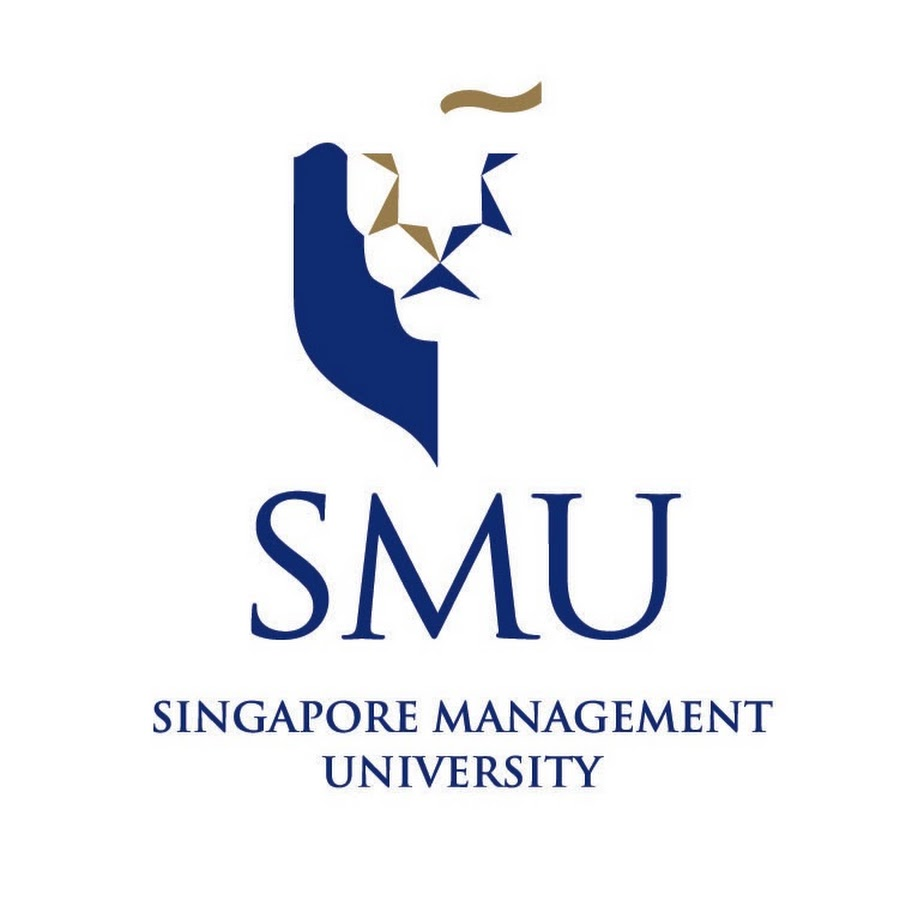
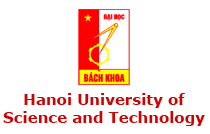
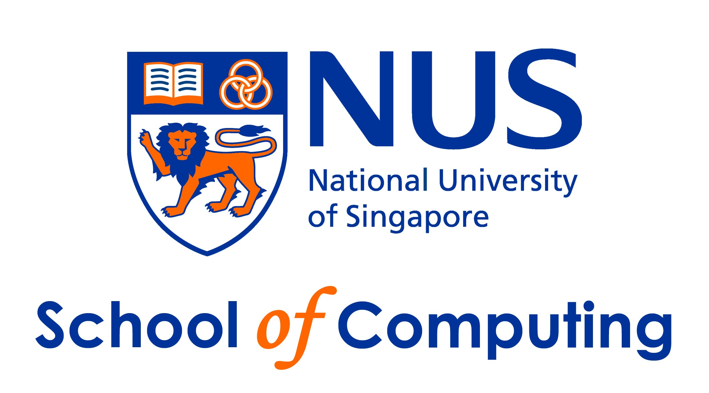

---
#
# By default, content added below the "---" mark will appear in the home page
# between the top bar and the list of recent posts.
# To change the home page layout, edit the _layouts/home.html file.
# See: https://jekyllrb.com/docs/themes/#overriding-theme-defaults
# 
# [GitHub](http://github.com)
# 

# 

# 

 
# 

# 

# 

 
#
layout: home
title: Home
--- 

> “Curiosity is the wick in the candle of learning.“  - William Arthur Ward

Welcome to my homepage. My name is Bach (LE, Dinh Xuan Bach).  
ようこそ！私はバイックです。なんかドイツらしい名前だね（笑）
                                       
My [CV](https://drive.google.com/file/d/0B0IKIOXrT2Q4UFhRZHh6a2c3dkk/view) is available [here](https://drive.google.com/file/d/0B0IKIOXrT2Q4UFhRZHh6a2c3dkk/view),  with [Google Scholar](https://scholar.google.com.sg/citations?user=AUJWzE8AAAAJ&hl=en), [DBLP](http://dblp.uni-trier.de/pers/hd/l/Le:Xuan=Bach_D=).

**Research Interests:** Software Mining, Analysis, Repair, Synthesis and Verification.

**Education & Research Experience:** 

PostDoc, **Carnegie Mellon University, Silicon Valley**, June'18 - Present  
Supported by DARPA STAC program, [ISSTAC](http://sv.cmu.edu/research/cybersecurity/ISSTAC.html) project.  
Topic: Software Security, Advisor: Associate Research Prof. [Corina Pasareanu](https://scholar.google.com/citations?user=pwIuivQAAAAJ&hl=en)
 
PhD Candidate, **Singapore Management University, Singapore**, Jan'14 - May'18  
Supported by [LARC-Carnegie Mellon University](https://larc.smu.edu.sg/) collaboration program.  
Topic: Automatic software repair, Advisor: Associate Prof. [David Lo](https://scholar.google.com/citations?user=Ra4bt-oAAAAJ&hl=en)

PhD Residency Training, **Carnegie Mellon University, Pittsburgh USA**, Aug'15 - June'16  
Under [LARC-CMU](https://larc.smu.edu.sg/) collaboration program, supported by Singapore Ministry of Education.  
Topic: Automatic software repair, Host: Assistant Prof. [Claire Le Goues](https://scholar.google.com/citations?user=Cmr9ljkAAAAJ&hl=en)
 
BSc (Hons), **Hanoi University of Science and Technology, Vietnam**, Aug'07 - May'12  
Topic: SAT solvers and its application in software verification  
Advisors: Associate Prof. [HUYNH Quyet Thang](https://soict.hust.edu.vn/en/index.php/our_team/psg-ts-huynh-quyet-thang/), and Associate Prof. [Wei Ngan Chin](https://scholar.google.com/citations?user=DO2x-J0AAAAJ&hl=en)
 
Research Assistant, **National University of Singapore, Singapore**, Aug'12 - Nov'13  
Topic: Static software verification using SAT and Separation Logic  
Advisor: Associate Prof. [Wei Ngan Chin](https://scholar.google.com/citations?user=DO2x-J0AAAAJ&hl=en)
 
Research Intern, **National University of Singapore, Singapore**, Feb'12 - May'12  
Topic: Static software verification using SAT and Separation Logic  
Advisor:  Associate Prof. [Wei Ngan Chin](https://scholar.google.com/citations?user=DO2x-J0AAAAJ&hl=en)

Undergraduate Intern, **Nagoya University**, Japan, Aug'12  
Topic: Building a social network application, Host:  Prof. Toyohide WATANABE  

**Languages:** Vietnamese (native), English, and Japanese (intermediate, level 2 of [Japanese Language Proficiency Test](https://www.jlpt.jp/e/about/levelsummary.html) in 2009)

**Teaching:** 
- Guest Lecturer: Program Analysis and Modeling, Graduate level, SMU, 2018
- Teaching Assistant: Software Mining and Analysis, Graduate level, SMU, 2018
- Teaching Assistant: Analytics Foundations, Undergraduate level course, SMU, 2017

**Student Supervision:** 
- Siyu Xie, undergraduate student from Zhejiang University, China, visited SMU during 2017-2018. 
  This resulted in a full research paper on automatic repair, now under submission. 

**Academic Services:** 

* Reviewer: 
	- 2018: Journal of Systems and Software
	- 2017: Empirical Software Engineering Jounal

* Sub-reviewer:
	- 2018: SCAM, ESEC/FSE (Tool Track)
	- 2017: ICSME, IWESEP, VL/HCC, RV
	- 2016: SAC, SATE, MSR (data track), ICECCS, APSEC
	- 2014: POPL
	- 2013: SAC

**Hobbies:** 
- Classical guitar
- I am a huge fan of Vietnam football.

